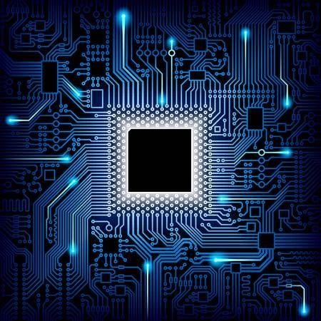

# 🌐 Tech - Página sobre Tecnologia

Este é um projeto de **landing page responsiva** desenvolvido com **HTML5**, **CSS3** e **JavaScript Vanilla**, com o objetivo de praticar conceitos de estrutura de layout, responsividade e interatividade simples para dispositivos móveis.

## 📸 Prévia

---

## 🚀 Funcionalidades

- ✅ Layout responsivo para celular, tablet e desktop
- ✅ Menu hamburguer funcional em telas pequenas
- ✅ Seções bem definidas: Início, Recursos, Sobre
- ✅ Botões com links e estilos atrativos
- ✅ Design limpo e moderno

---

## 🛠️ Tecnologias utilizadas

- HTML5
- CSS3
- JavaScript Puro
- Design Responsivo com Media Queries
